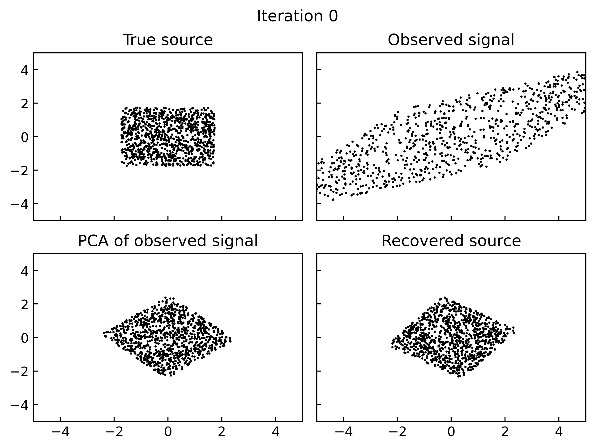

# Independent component analysis with Jax

Notes [here](https://tuananhle.co.uk/notes/ica.html).

Run
```
python toy_data.py
python timeseries.py
python prior.py
```
to run ICA on the toy and timeseries datasets and produce the following gifs



